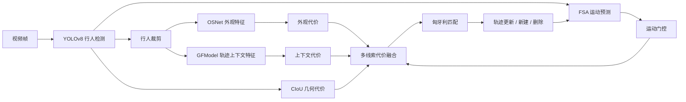

# Architecture / 系统架构

## 中文

AMFTrack 的在线跟踪链路如下：

跟踪器在每帧执行以下顺序：

1. 对所有存量轨迹执行 FSA `predict()`；
2. YOLOv8 输出行人边界框与置信度；
3. OSNet 与 GFModel 对检测框裁剪进行特征编码；
4. 计算外观余弦距离、GFModel 余弦距离、CIoU 几何代价和马氏距离门控；
5. 将多种代价按 YAML 权重融合；
6. 使用 Hungarian assignment 得到一阶段匹配；
7. 对剩余轨迹和检测使用 CIoU 进行第二阶段恢复匹配；
8. 更新轨迹状态、外观特征库和运动状态。

## English

The online tracking pipeline contains six interacting subsystems: YOLOv8 detection, OSNet appearance encoding, GFModel context encoding, FSA motion prediction, CIoU geometry matching and Hungarian assignment.

At each frame, existing tracks are predicted by FSA first. New detections are encoded by OSNet and GFModel. Appearance, context and CIoU costs are fused under a Mahalanobis motion gate. A Hungarian assignment produces the primary association, followed by a CIoU recovery stage for unmatched candidates. Track state, feature galleries and motion estimates are then updated.
